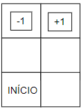
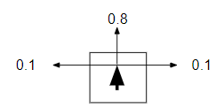

# Atividade sobre Decisoes Sequenciais (MDP)

## Contexto

- Interação termina quando o agente alcança um dos estados finais (+1 ou -1).
- Ações disponíveis: Up, Down, Left e Right.
- As ações tem resultado aleatório conforme o modelo de transição ao lado.
  - Eg.: Ação UP tem 0.8 de probabilidade de ter sucesso
- Se o agente bater em uma parede permanecerá no mesmo quadrado.
- Em cada estado s, o agente recebe uma Recompensa R(s):
  - R(s) = -0.04 para todos estados não terminais.
- Dois estados finais R(s) = +1 ou R(s) = -1.

### Matriz



### Modelo de Transição


(Eg.: Ação UP)

## Problema

- Crie as matrizes de probabilidade de transição de estados: T(s,a,s’).
  - Probabilidade de chegar a s’ como resultado da execução da ação a no estado s.
- Crie o vetor de recompensas: R(s).
- Implemente a função de atualização de estados baseado na equação de Bellman:
  - U(s) = R(s) + γ maxa Σs’ T(s,a,s’) U(s’)
  - Nesse exercício, assuma γ = 1
- Implemente a função para retornar a política baseada nos valores de utilidade dos estados:
  - π(s) = argmaxa Σs’ T(s,a,s’) U(s’)
- Execute a função de atualização de utilidades por várias iterações e retorne a política encontrada
  - Critério de parada: número máximo de iterações ou convergência dos valores das utilidades

## Tecnologias utilizadas

Essa atividade foi desenvolvida com as seguintes tecnologias:

- JavaScript
- Node

## Instruções

- Certifique-se que você tem instalado na sua máquina o [node](https://nodejs.org/en).
- Faça um `git clone` no repositório.
- Pelo terminal navegue até a pasta do projeto utilizando `cd atividade-decisoes-sequenciais`.
- Após isso execute o comando `node index.js` e os resultados serão visualizados na tela.

## Modificações

- Você pode modificar os valores das matrizes de transição das ações, alterando as variáveis `t_up, t_down, t_left` e `t_right` ou adicionar outras matrizes de acordo com os dados que você necessita.
- Você pode alterar o tamanho do mundo baseado no seu caso de uso, modificando: as matrizes de transição (`t_up, t_down,...`), matriz de recompensa (`rw`), a matriz de valor (`value`) e os `for` das linhas 116 e 160, para terem o tamanho do total de estados do seu problema.
- Você pode alterar as variáveis `aux` das linhas 101 e 140 para representar a disposição dos seus estados no seu mundo. Eg.: 5x5, 4x3.
- Por fim, é importante lembrar que embora no exemplo apresentado tenha 20 iterações apenas, é possível que dependendo da quantidade de estados do seu caso de uso seja necessário mais iterações. Isso pode ser modificado no `for` da linha 209.

## Output

- Para cada iteração será retornado o seguinte output, listando os valores antes e depois da execução das funções:

```
INPUT UTILITIES
┌─────────┬────┬───┐
│ (index) │ 0  │ 1 │
├─────────┼────┼───┤
│    1    │ -1 │ 1 │
│    2    │ 0  │ 0 │
│    3    │ 0  │ 0 │
└─────────┴────┴───┘
OUTPUT UTILITIES
┌─────────┬───────┬───────┐
│ (index) │   0   │   1   │
├─────────┼───────┼───────┤
│    1    │  -1   │   1   │
│    2    │ -0.04 │ 0.76  │
│    3    │ -0.04 │ -0.04 │
└─────────┴───────┴───────┘
```

- Ao final, será retornado a política baseada nos valores resultantes para estado:

```
-1 +1
DW UP
RG UP
```
